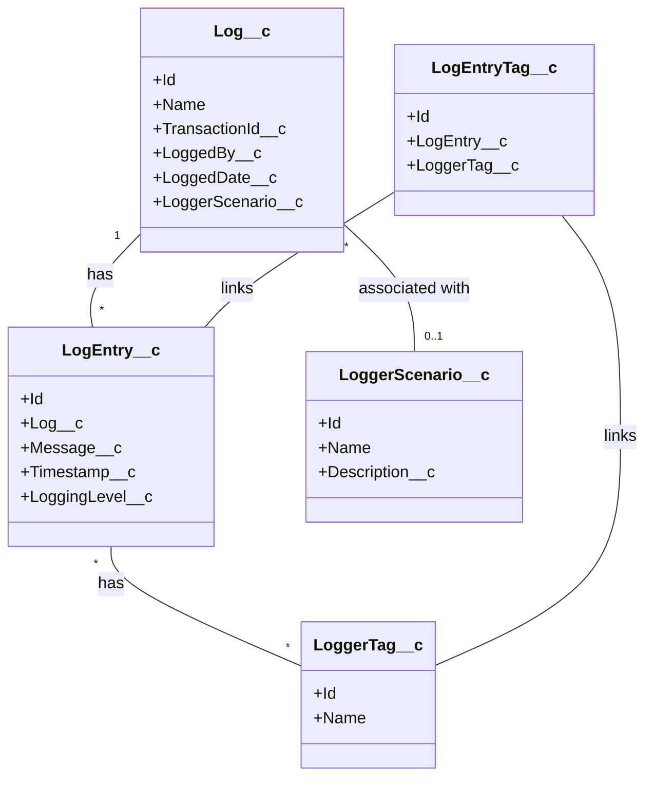

# nebula_doc

```mermaid
classDiagram
    Log__c "1" -- "*" LogEntry__c : has
    LogEntry__c "*" -- "*" LoggerTag__c : has
    LogEntryTag__c -- LogEntry__c : links
    LogEntryTag__c -- LoggerTag__c : links
    Log__c "*" -- "0..1" LoggerScenario__c : associated with

    class Log__c {
        +Id
        +Name
        +TransactionId__c
        +LoggedBy__c
        +LoggedDate__c
        +LoggerScenario__c
    }

    class LogEntry__c {
        +Id
        +Log__c
        +Message__c
        +Timestamp__c
        +LoggingLevel__c
    }

    class LogEntryTag__c {
        +Id
        +LogEntry__c
        +LoggerTag__c
    }

    class LoggerScenario__c {
        +Id
        +Name
        +Description__c
    }

    class LoggerTag__c {
        +Id
        +Name
    }
```
